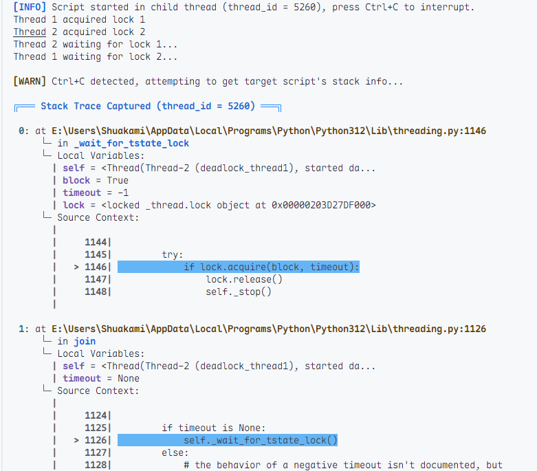

# PyUnstuck

*Your lifesaver for frozen Python scripts*

[](https://github.com/shuakami/pyunstuck/stargazers)
[](https://github.com/shuakami/pyunstuck#-requirements)
[](https://github.com/shuakami/pyunstuck/releases)

---

Ever had a Python script freeze and `Ctrl+C` won't work? PyUnstuck is your solution. It provides deep insight into frozen scripts, deadlocks, and thread hangs - all with a beautiful stack trace visualization.

## ✨ Highlights

- **Zero Config**: Just run it against your script
- **Beautiful Output**: Rust-style stack traces with syntax highlighting
- **Smart Analysis**: Automatically detects deadlocks and resource issues
- **Safe Recovery**: Gracefully terminates frozen threads
- **Works Everywhere**: Windows, Linux, MacOS supported

## 🚀 Quick Start

```bash
# Install from PyPI (Global)
pip install pyunstuck

# For users in China (国内用户推荐)
pip install -i https://pypi.tuna.tsinghua.edu.cn/simple pyunstuck

# Run PyUnstuck to analyze the deadlock
pyunstuck deadlock_test.py
```

When your script hangs, just press `Ctrl+C`. PyUnstuck will show you exactly what's going on.

## 📸 Screenshot



## 🎯 Perfect For

- Debugging unresponsive scripts
- Finding deadlocks in multi-threaded code
- Understanding why your script is frozen
- Analyzing resource usage and bottlenecks

## 💡 Example

Here's a classic deadlock scenario that PyUnstuck can help you debug:

```python
import threading
import time

def deadlock_thread1(lock1, lock2):
    with lock1:
        time.sleep(1)  # Ensure deadlock happens
        with lock2:
            print("Thread 1")

def deadlock_thread2(lock1, lock2):
    with lock2:
        time.sleep(1)
        with lock1:
            print("Thread 2")

# Run this and watch it deadlock
lock1, lock2 = threading.Lock(), threading.Lock()
threading.Thread(target=deadlock_thread1, args=(lock1, lock2)).start()
threading.Thread(target=deadlock_thread2, args=(lock1, lock2)).start()
```

## 🔧 Requirements

- Python 3.11+
- psutil (auto-installed)
- Any major OS

## 🤝 Contributing

Contributions are what make the open source community amazing. Any contributions you make are **greatly appreciated**.

1. Fork the Project
2. Create your Feature Branch (`git checkout -b feature/AmazingFeature`)
3. Commit your Changes (`git commit -m 'Add some AmazingFeature'`)
4. Push to the Branch (`git push origin feature/AmazingFeature`)
5. Open a Pull Request

## 📜 License

Distributed under the MIT License. See `LICENSE` for more information.

## 🌟 Similar Tools

While these tools are great, PyUnstuck focuses on simplicity and beautiful output:

- [py-spy](https://github.com/benfred/py-spy) - Sampling profiler
- [pyrasite](https://github.com/lmacken/pyrasite) - Injection tool
- [manhole](https://github.com/ionelmc/python-manhole) - Debugging portal

---

<div align="center">

Made with ❤️ by [shuakami](https://github.com/shuakami)

If you find PyUnstuck helpful, please consider giving it a star ⭐

</div> 